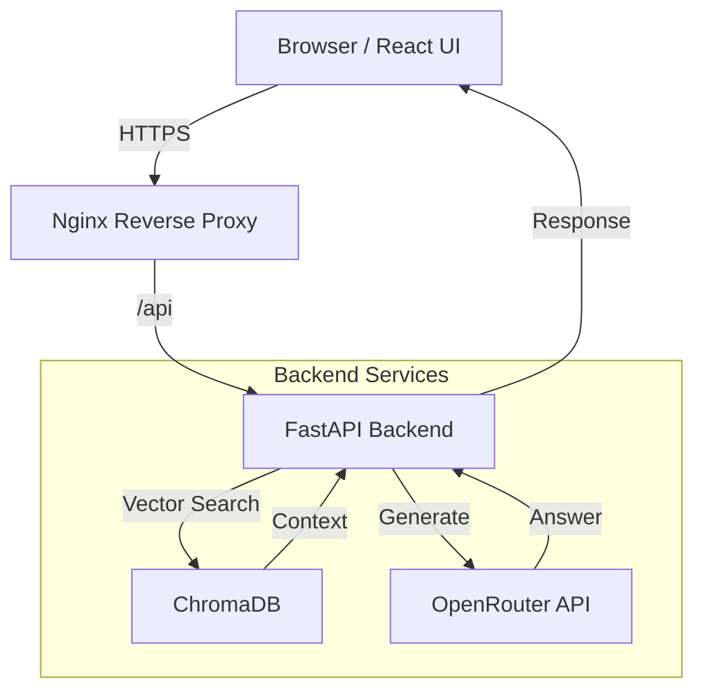

# 🤖 AI Agent RAG Chatbot


An end-to-end **Retrieval-Augmented Generation (RAG)** chatbot built with a production-style stack.
This project currently provides a robust MVP covering ingestion, retrieval, and LLM generation, with a fully automated **Self-Hosted CI/CD pipeline**.

> **Status:** MVP Complete. Currently transitioning to a research-grade system focusing on Hybrid Search, Reranking, and High-Concurrency Engineering.

---

## 🔥 Highlights
- End-to-end: React → FastAPI → LLM (RAG), complete request path with retrieval grounding.
- DevOps: CI/CD + Nginx + Docker Compose + HTTP/SSL, eliminating manual release errors and enabling automation.
- Full-stack productionization: self-hosted pipeline from code to deployment, real-world readiness.

### ✅ Core Architecture (Completed)
The foundation of the system is fully operational:
* **Full-Stack RAG:** React frontend coupled with FastAPI backend and ChromaDB vector storage.
* **Production Deployment:** Docker Compose orchestration with **Nginx Reverse Proxy** handling static files and API routing.
* **Secure Access:** Token-based authentication (Basic) and HTTPS support.
* **DevOps Automation:** Self-hosted **Jenkins Pipeline** that automates the `Pull -> Build -> Deploy` workflow.
* **Operations:** Port convergence via Nginx and separate Dev/Prod environment configurations.

### 🚧 Engineering & Research Roadmap (Work in Progress)
I am actively working on upgrading the system to solve the **"Semantic Gap"** and **"Context Loss"** inherent in basic RAG pipelines, while enforcing production-level **SLOs**.

#### 1. Advanced RAG Algorithms 
* **Multi-Format Data Ingestion**
    * **Problem:** Critical knowledge is often locked in unstructured, proprietary binary formats (PDF, DOCX) with complex layouts.
    * **Solution:** Implementing a unified **ETL pipeline** that normalizes diverse file types into clean, machine-readable text.
    * **Technique:** Utilizing format-specific parsers combined with **Recursive Character Text Splitting** to preserve document structure during chunking.
    * **Tech:** `pypdf`, `python-docx`, `LangChain Text Splitters`.
* **Hybrid Search Implementation**
    * **Problem:** Pure semantic search fails to capture exact matches for domain-specific acronyms or product codes.
    * **Solution:** Implementing **BM25 (Keyword)** alongside **Vector Search**.
    * **Technique:** Using **Reciprocal Rank Fusion (RRF)** to merge sparse and dense retrieval results for higher precision.
    * **Tech:** ChromaDB (Hybrid Mode) / Elasticsearch.

* **Two-Stage Retrieval with Reranking**
    * **Problem:** The initial `top-k` vectors often contain irrelevant context that distracts the LLM ("Lost-in-the-Middle" phenomenon).
    * **Solution:** Expanding initial retrieval to `top-50`, then applying a **Cross-Encoder** model to re-score and select the precise `top-5`.
    * **Tech:** BGE-Reranker / Cohere Rerank.

* **GraphRAG (Knowledge Graph Integration)**
    * **Problem:** Text chunking severs logical relationships between entities across different documents.
    * **Solution:** Constructing a Knowledge Graph to capture entity relationships. Retrieval will traverse graph paths alongside vector similarity.
    * **Tech:** Neo4j / NetworkX.

#### 2 System Evaluation & Observability
* **Quantitative RAG Evaluation**
    * **Goal:** Moving from "vibes-based" testing to data-driven metrics.
    * **Metrics:** Measuring **Faithfulness** (Hallucination rate) and **Context Recall**.
    * **Tech:** **Ragas** or **TruLens** framework.

#### 2. System Performance & Engineering
* **Adaptive Query Routing:** Dynamically selecting strategies (`Small-k` vs `Hybrid`) based on query complexity classification.
* **Async Ingestion Pipeline:** Decoupling PDF parsing using **Celery + Redis** to handle large-scale knowledge base updates without blocking main threads.
* **Latency SLOs:** Enforcing strict **<800ms P99 latency** targets via multi-layer caching strategies.

---

## 🏗 System Architecture

### Runtime Request Flow


### CI/CD Workflow
The project uses a self-hosted Jenkins instance to ensure consistent deployments:
1. **Source:** Developer pushes code to GitHub.
2. **Trigger:** Webhook triggers the Jenkins pipeline.
3. **Build:** Jenkins builds React static assets (`npm run build`).
4. **Deploy:** Docker Compose updates the containers with zero downtime.

---

## 🛠 Tech Stack

| Component | Technology | Role |
| :--- | :--- | :--- |
| **Frontend** | React, Tailwind CSS | Single Page Application (SPA) with chat interface |
| **Backend** | Python, FastAPI | Async REST API and RAG orchestration |
| **Database** | ChromaDB | Vector storage for embeddings |
| **Model Provider** | OpenRouter | Access to GPT-4, Claude 3, etc. |
| **Infrastructure** | Docker, Nginx | Containerization and reverse proxy |
| **CI/CD** | Jenkins | Automated build and deployment pipeline |

---

## ⚡ Getting Started

### Prerequisites
* Docker & Docker Compose
* Node.js (for local frontend development)
* Python 3.10+ (for local backend development)

### 1. Clone the Repository
```bash
git clone https://github.com/your-username/ai-agent-rag.git
cd ai-agent-rag
```

### 2. Environment Setup
Create a `.env` file in the project root directory:
```bash
OPENROUTER_API_KEY=your_key_here
CHROMA_DB_PATH=./chroma_data

# Engineering constraints
MAX_TOKEN_BUDGET=100000
LATENCY_SLO_MS=800
```

### 3. Run with Docker Compose
This brings up the backend, frontend (served via Nginx), and database:
```bash
docker-compose up -d --build
```

**Access points:**
* **Frontend:** `http://localhost`
* **API Docs:** `http://localhost/docs`

---

## 📖 API Usage Examples

### Ingest Documents
```bash
curl -X POST "http://localhost/api/ingest" \
  -H "Content-Type: application/json" \
  -d '{"text": "Your knowledge base content here..."}'
```

### Chat (Future Adaptive Mode)
Example of intended future usage with strategy routing:
```bash
curl "http://localhost/api/chat?query=System+Architecture&strategy=hybrid"
```

---

Kyle Hu wrote by passion.
